

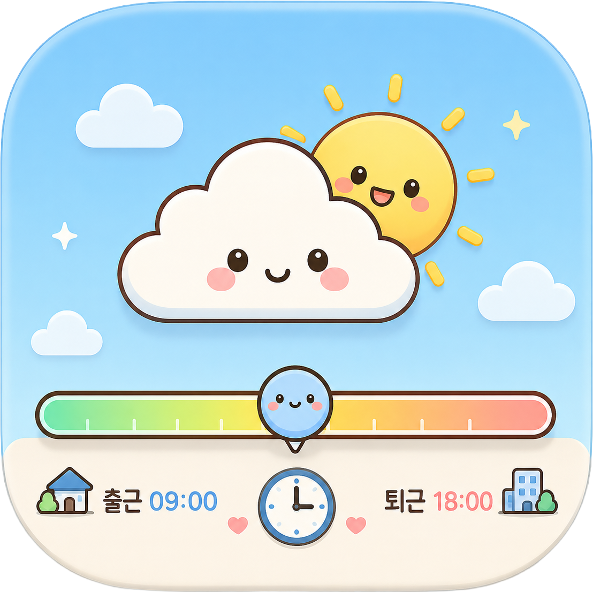

# 퇴근구름 (CloudyLine)

**일하는 하루의 흐름과 지금 날씨를, 작업 표시줄 위 얇은 라인 하나로.**

작업 표시줄 바로 위에 출근–퇴근 시간 진행 라인을 그리고, 현재 날씨 아이콘이 지금 시각 위치를 따라 이동하는 Windows 데스크톱 유틸리티입니다. 앱을 따로 열지 않아도 하루가 얼마나 흘렀는지와 현재 날씨를 한눈에 확인할 수 있습니다.

---

## 이런 분께 좋아요

- 일하다 보면 지금이 하루 중 어디쯤인지 감을 놓치는 분
- 출근–퇴근 시간의 흐름을 **항상 보이는 곳에** 두고 싶은 분
- 날씨 앱을 따로 켜지 않고 **현재 날씨를 슬쩍 확인**하고 싶은 분
- 내 데이터가 외부로 나가지 않고 **내 PC에서만 동작**하는 가벼운 도구를 원하는 분

> 퇴근구름은 작업 표시줄 위에 얇고 투명한 라인만 띄웁니다. 평소 작업을 가리지 않으면서, 시간과 날씨를 조용히 보여 줍니다.

---

## 지원 환경

| 항목 | 내용 |
|---|---|
| 운영체제 | Windows 10 (버전 1809 이상) / Windows 11 |
| 지원 언어 | 한국어 · English · 日本語 · 简体中文 · 繁體中文 |
| 날씨 데이터 | **WeatherAPI.com**(전 세계) 또는 **기상청 단기예보**(국내) 중 선택 — 사용자가 발급한 API Key 필요 |

개발에 사용한 기술 (개발자용 참고)

- **UI 프레임워크**: WinUI 3 (Windows App SDK) + 오버레이는 WPF 별도 스레드
- **언어 / 런타임**: C# / .NET 10
- **구조**: MVVM (CommunityToolkit.Mvvm) + 의존성 주입
- **데이터 저장**: 로컬 PC의 JSON 파일 (외부 서버로 전송하지 않음)
- **API Key 저장**: Packaged 환경 PasswordVault / Unpackaged 환경 DPAPI (평문 저장·로그 출력 안 함)

---

## 가장 먼저 알아 두면 좋은 것 — API Key

퇴근구름은 날씨를 직접 가져오지 않고, **사용자가 직접 발급한 날씨 서비스의 API Key**를 사용합니다. (개발자 키가 들어 있지 않습니다.) 키 발급은 무료이며, 둘 중 하나만 있으면 됩니다.

- **WeatherAPI.com** — 전 세계 어디든 사용 가능. 도시명이나 위경도로 위치를 지정합니다.
- **기상청 단기예보** (공공데이터포털) — 국내 전용. 시도→시군구→읍면동 행정구역으로 위치를 지정합니다.

> 💡 키가 아직 없어도 괜찮습니다. 처음 실행 시 안내(온보딩)에서 **"나중에 입력"**을 선택하면 키 없이 둘러볼 수 있고, 나중에 [날씨 API](#-날씨-api-화면) 화면에서 입력하면 됩니다.

---

## 처음 시작하기

1. **앱을 실행하면 처음 한 번은 안내 화면(온보딩)이 나타납니다.** 5단계로 진행되며, 날씨 제공자 선택과 API Key·위치 입력을 차근차근 안내합니다.
2. 안내를 마치면 **메인 창**이 열리고, 작업 표시줄 오른쪽 끝(시계 옆)의 **시스템 트레이**에 퇴근구름 아이콘이 상주합니다.
3. **창을 닫아도 앱은 종료되지 않습니다.** 트레이에서 계속 동작하며 작업 표시줄 위 라인을 그립니다.
4. 설정이 끝나면 작업 표시줄 위에 **얇은 라인**이 나타나고, 현재 시각 위치에 **날씨 아이콘**이 표시됩니다.

> 💡 [일반](#-일반-화면) 화면에서 **자동 시작**을 켜 두면 PC를 켤 때마다 퇴근구름이 알아서 실행됩니다.

> 퇴근구름은 **단일 인스턴스**로 동작합니다. 이미 실행 중일 때 다시 실행하면 새 창이 뜨지 않고 기존 창(트레이에 숨어 있던 메인 창 포함)이 앞으로 올라옵니다.

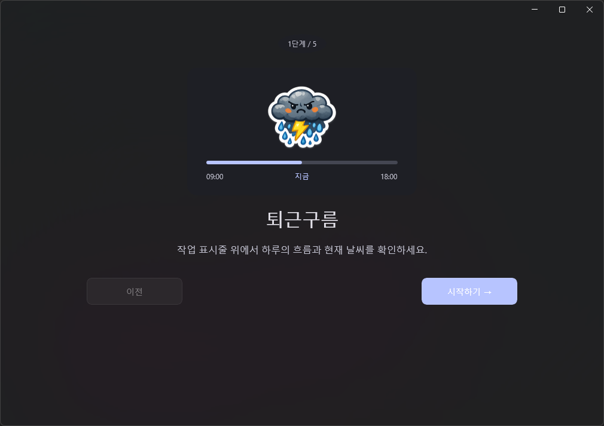

---

## 안내 화면(온보딩) 5단계

처음 실행할 때 한 번만 나타나며, 다음 순서로 진행됩니다.

1. **환영 / 소개** — 퇴근구름이 무엇을 하는지 소개합니다.
2. **시간 설정 미리보기** — 출근·퇴근 시간 흐름을 간단히 안내합니다.
3. **날씨 제공자 + API Key** — **WeatherAPI.com**과 **기상청** 중 하나를 고르고 키를 입력합니다.
   - 기상청을 고르면 격자 기본값(서울)이 자동으로 들어가며, 나중에 [날씨 API](#-날씨-api-화면) 화면에서 바꿀 수 있습니다.
   - **"나중에 입력"**에 체크하면 키 없이 진행할 수 있습니다. 이때는 4단계(지역)를 건너뛰고 바로 5단계로 넘어갑니다.
4. **지역 / 위치** — 날씨를 가져올 위치를 정합니다.
5. **미리보기 / 완료** — 라인이 어떻게 보이는지 확인하고 마칩니다.

> "이전" 버튼으로 단계를 되돌아갈 수 있습니다. 한 번 완료하면 다음 실행부터는 이 화면이 나오지 않습니다.

---

## 작업 표시줄 위 라인(오버레이) 한눈에 보기

퇴근구름의 핵심은 작업 표시줄 위에 떠 있는 **오버레이 라인**입니다.

- **시간 진행 라인** — 출근 시각이 한쪽 끝, 퇴근 시각이 반대쪽 끝입니다. 현재 시각이 라인 위 위치로 표시됩니다.
- **날씨 아이콘** — 현재 시각 위치를 따라 라인 위를 이동하며, 지금 날씨를 아이콘으로 보여 줍니다.
- **항상 최상위** — 다른 창 위에 떠 있도록 1초 주기로 유지됩니다. 단, **전체화면 앱**(게임·전체화면 영상·발표)이 앞에 오면 자동으로 양보하고, 해제되면 다시 나타납니다.
- **클릭 투과** — 기본적으로 라인을 클릭하면 아래에 있는 작업 표시줄·아이콘이 눌립니다. 라인이 작업을 방해하지 않습니다.
- **위치 4방향** — 가로(작업 표시줄 위·아래) 또는 세로(모니터 왼쪽·오른쪽)로 [디자인](#-디자인-화면) 화면에서 바꿀 수 있습니다.

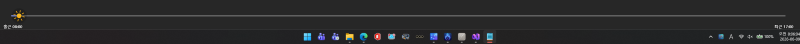

---

## 화면별 안내

메인 창은 왼쪽에 메뉴(사이드바)가 있고, 메뉴를 누르면 오른쪽에 해당 화면이 나타납니다. 메뉴 순서는 다음과 같습니다.

- 🏠 **대시보드** — 지금 상태·날씨·예보를 한눈에
- 🕒 **시간 설정** — 출근·퇴근 시각과 동작 요일
- 🌤️ **날씨 API** — 제공자·위치·API Key
- 🎨 **디자인** — 라인·아이콘·오버레이 꾸미기
- ⚙️ **일반** — 자동 시작·언어·테마·갱신 주기
- 🔧 **문제 해결** — 상태 진단과 초기화 (구분선 아래)
- ℹ️ **정보** — 버전·데이터 제공·라이선스 (사이드바 맨 아래)

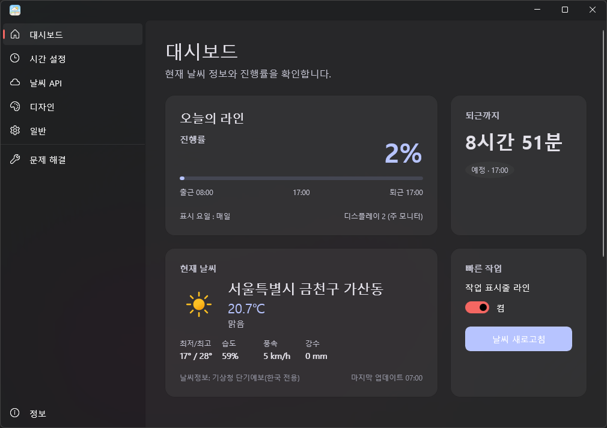

---

### 🏠 대시보드 화면

앱을 열면 가장 먼저 보이는 화면으로, **현재 상태·날씨·예보**를 카드로 보여 줍니다.

- **오늘의 라인** — 지금 시각이 하루 흐름 중 어디쯤인지 보여 주고, 카드 하단에 **"표시 요일 : 월, 화, 수"** 형식으로 라인이 동작하는 요일이 표시됩니다. (모든 요일이면 "매일", 선택한 요일이 없으면 "없음")
- **현재 날씨** — 현재 날씨와 함께 **"날씨정보: {제공자명}"**이 표시되고, 체감·습도·풍속·강수·자외선·최저/최고가 나옵니다. (기상청이 제공하지 않는 항목은 자동으로 숨겨집니다.)
- **시간별 예보** — 가까운 시간대의 날씨를 셀로 보여 줍니다. (제공자에 따라 셀 구성이 다릅니다.)
- **일별 예보** — 내일·모레 등 며칠 치 예보를 보여 줍니다.
- **빠른 동작(Quick Actions)** — 자주 쓰는 동작을 바로 실행할 수 있습니다.

> 날씨를 아직 받지 못했거나 키가 없으면 일부 카드는 골격만 표시됩니다. [날씨 API](#-날씨-api-화면) 화면에서 키와 위치를 설정하면 채워집니다.

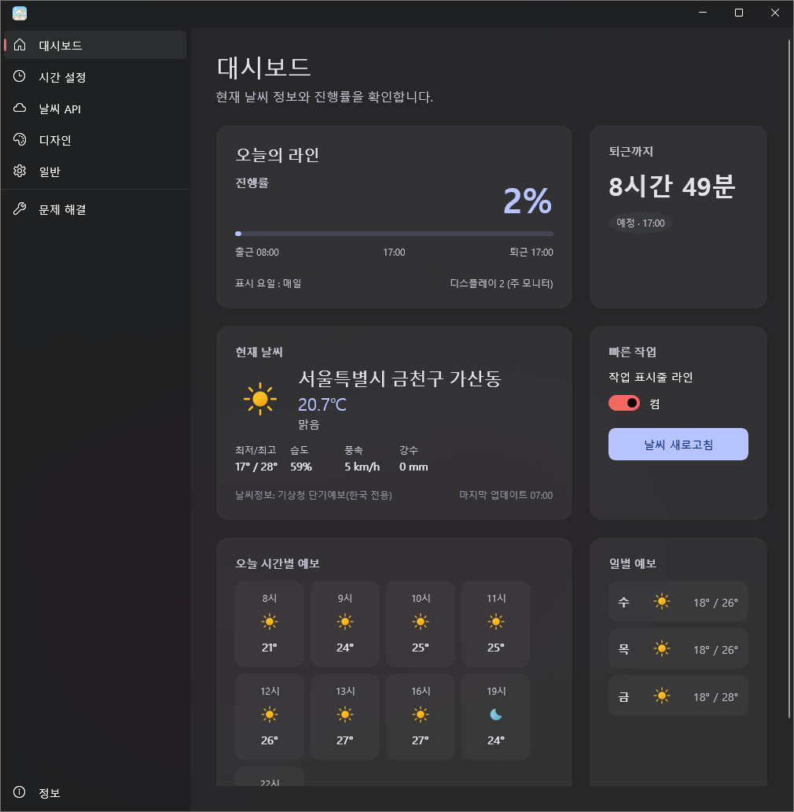

---

### 🕒 시간 설정 화면

작업 표시줄 라인이 **언제, 어떤 요일에** 표시될지 정하는 화면입니다.

- **표시 모드** — 두 가지 중 선택합니다.
  - **사용자 시간** — 직접 정한 **출근 시각**과 **퇴근 시각** 사이를 라인으로 그립니다.
  - **24시간** — 0:00부터 24:00까지 하루 전체를 라인으로 그립니다. (이 모드에서는 출퇴근 입력과 "종료 후 고정"이 비활성화됩니다.)
- **종료 후 라인 숨김** — 퇴근 시각이 지나면 라인을 감출지 정합니다.
- **동작 요일** — 월~일 7개 토글 버튼으로, **선택한 요일에만** 라인이 표시됩니다. (기본값: 모든 요일. 전체를 끄면 매일 숨겨집니다.) 요일 선택은 두 표시 모드 모두에 적용됩니다.

> 💡 **저장 버튼이 없습니다.** 설정을 바꾸면 즉시 저장되고 오버레이에 바로 반영됩니다.

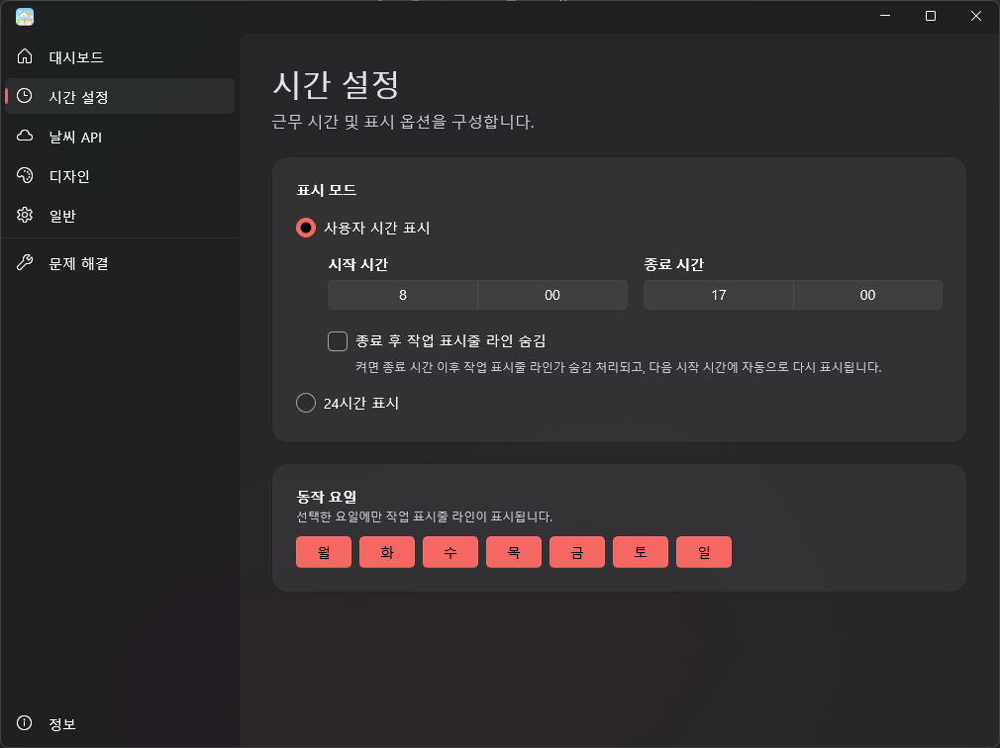

---

### 🌤️ 날씨 API 화면

날씨를 **어디서, 어느 위치로** 가져올지와 **API Key**를 관리하는 화면입니다. 세 개의 카드로 나뉩니다.

#### 1) 날씨 데이터 제공자
- **WeatherAPI.com**(전 세계) 또는 **기상청 단기예보**(한국 전용) 중에서 고릅니다.
- 콤보를 바꾸면 **즉시 저장**됩니다. (별도 저장 버튼 없음)
- 위치는 **제공자별로 따로 저장**됩니다. 제공자를 바꿔도 직전 값이 섞이지 않습니다.

#### 2) 지역 / 위치
- **WeatherAPI 선택 시** — 도시명 또는 위경도를 입력하고 **위치 확인** 버튼으로 확인합니다.
  - 입력란 옆 **"지역 선택"** 버튼을 누르면 도/시·군 목록 팝업에서 한국 지역을 골라 자동 입력할 수 있습니다.
- **기상청 선택 시** — **시도 → 시군구 → 읍면동** 순서로 지역을 고른 뒤 **"지역 저장"** 버튼으로 저장합니다. ("현재 지역: …"에는 실제로 저장된 지역이 표시됩니다.)
- **"현재 지역 검색"** 버튼 — Windows 위치 기능을 이용해 현재 위치를 자동으로 채우고, 이어서 위치 확인·적용까지 진행합니다. (위치 권한이 꺼져 있거나 한국 밖이면 안내 메시지가 표시됩니다.)

#### 3) API Key
- 발급 페이지 링크를 통해 키를 발급받아 입력합니다.
- **테스트** 버튼으로 키가 유효한지 확인하고, **저장 / 삭제**로 관리합니다.
- 카드 하단의 **"연결 확인"** 버튼으로 저장된 키로 실제 호출을 보내 상태·마지막 확인 시각·응답 속도를 갱신할 수 있습니다.

> 💡 잘못된 위치는 저장되지 않으며, 자동 갱신이 그 위치로 호출하지 않습니다. 위치가 잘못되면 카드 하단에 안내가 표시됩니다.

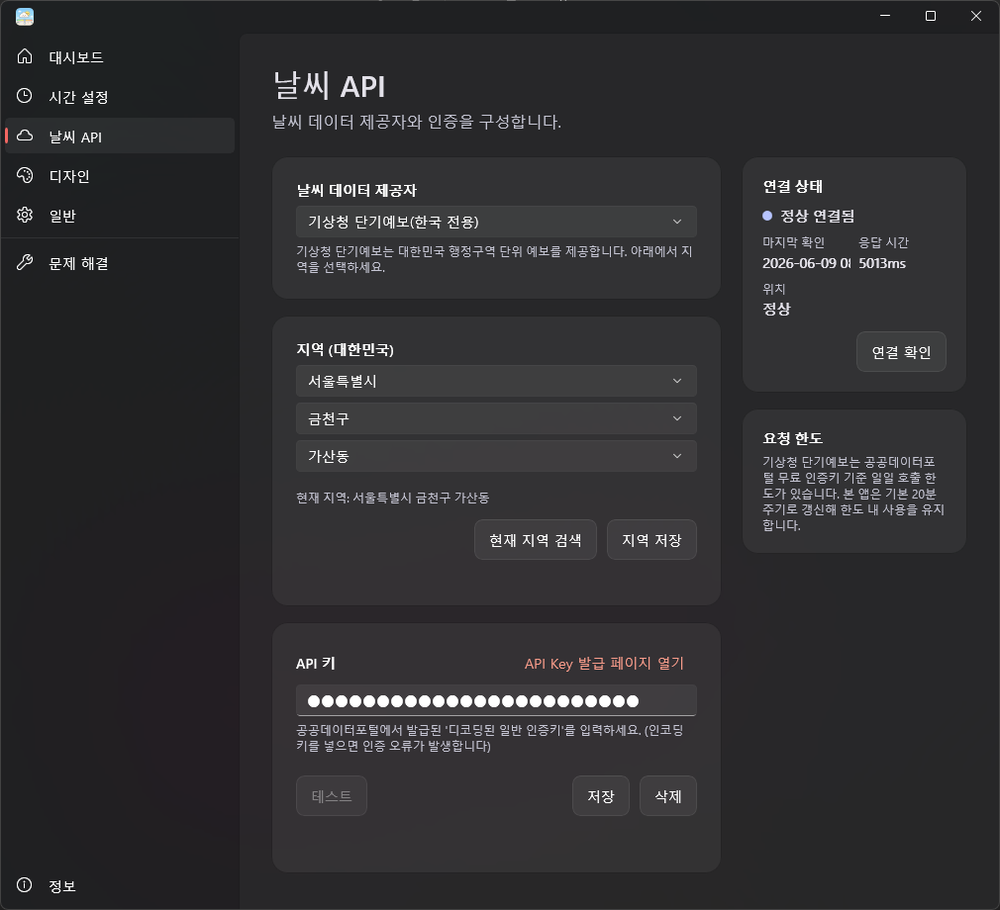

---

### 🎨 디자인 화면

작업 표시줄 위 라인과 아이콘의 **모습과 동작**을 꾸미는 화면입니다. 항목별 카드로 나뉘며, 크게 세 묶음입니다.

- **라인 디자인** — 라인 두께·색상, 그리고 라벨(라인 양 끝 표시)의 위치·표시 여부·문구·시각 표시.
- **오버레이 동작**
  - **오버레이 위치** — 가로(위·아래) / 세로(왼쪽·오른쪽).
  - **전체 투명도** — 라인 전체의 투명도.
  - **배경 투명도** — 라인 뒤 검은 배경의 진하기(0~100%, 0%면 배경 없음). 라인 투명도와 별개로 동작합니다.
  - **항상 위 / 클릭 투과** — 최상위 유지 여부, 클릭을 아래로 통과시킬지 여부.
  - **호버 시 강조** — 클릭 투과를 끈 상태에서, 마우스를 올리는 동안 투명도를 잠시 100%로 올립니다.
- **아이콘** — 크기·스타일·애니메이션·배경 색상/투명도, 그리고 **온도 표시**(켜면 날씨 아이콘 근처에 현재 온도(예: 18°)가 표시됩니다).

> 💡 **저장 버튼이 없습니다.** 바꾸는 즉시 저장되고 오버레이에 반영됩니다. (라벨 텍스트는 입력란을 벗어나거나 Enter를 누를 때 반영됩니다.)

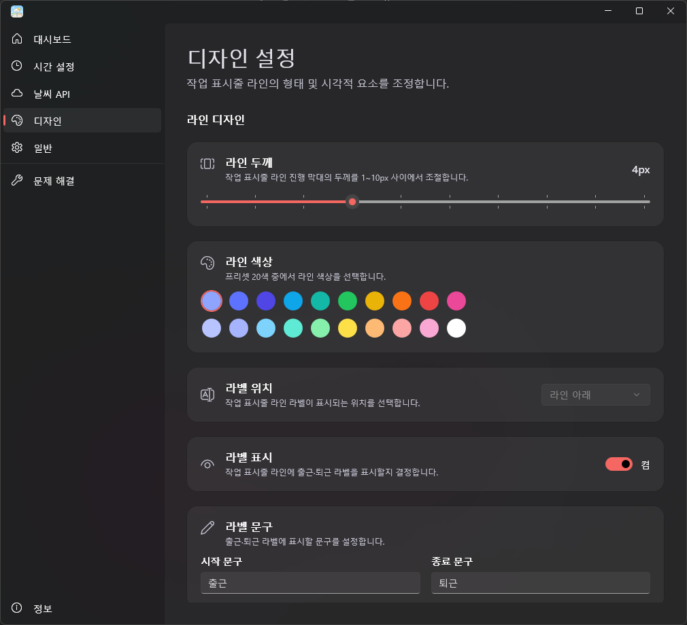

---

### ⚙️ 일반 화면

앱 전체의 동작을 관리합니다.

- **자동 시작** — Windows를 켤 때 퇴근구름을 자동으로 실행합니다.
- **언어** — 화면 언어를 고릅니다. **언어를 바꾸면 재시작 확인 창**이 뜨고, "다시 시작"을 누르면 저장 후 앱을 재시작해 완전히 적용합니다. ("취소" 시 이전 언어로 되돌립니다.)
- **앱 테마** — 앱 화면을 시스템 설정 / 라이트 / 다크 중에서 고릅니다. (즉시 적용)
- **데이터 갱신** — **날씨 갱신 주기**와 **아이콘 위치 갱신 주기**를 정합니다.
- **작업 표시줄 위치 자동 감지** — 켜면 오버레이가 작업 표시줄과 같은 모서리를 따라가고, 작업 표시줄을 옮기면 함께 이동합니다. 끄면 디자인에서 고른 위치에 고정됩니다. (기본 꺼짐)

> 💡 **저장 버튼이 없습니다.** 모든 설정 변경은 즉시 저장됩니다. (설정 초기화는 [문제 해결] 화면에 있습니다.)

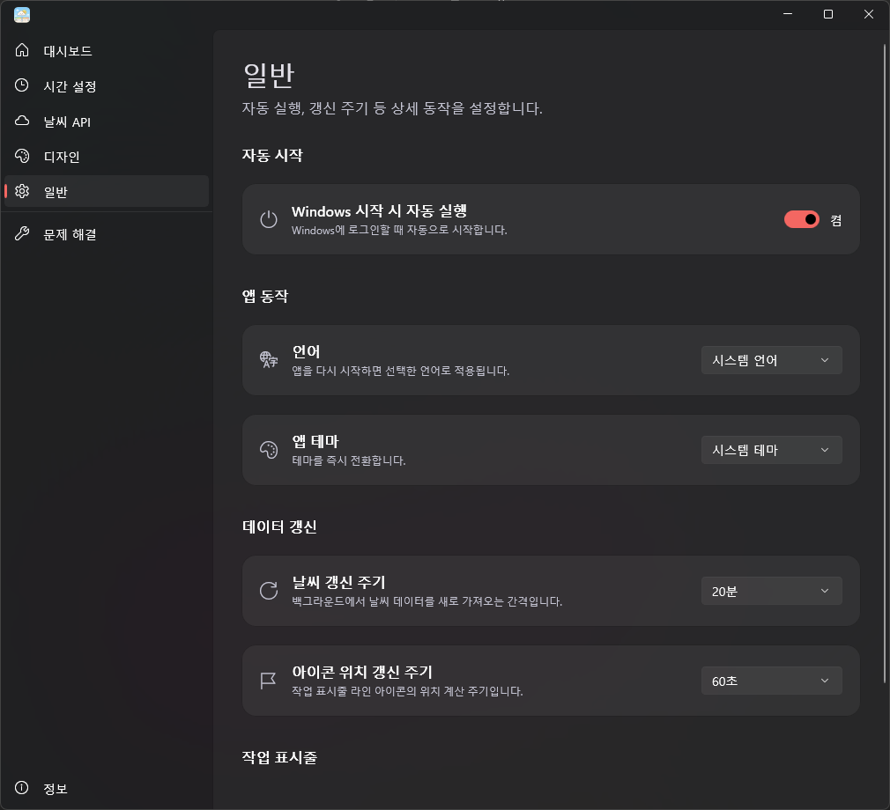

---

### 🔧 문제 해결 화면

날씨가 안 보이거나 동작이 이상할 때 **현재 상태를 진단**하고 정리하는 화면입니다.

- **상태 진단** — 제공자, API Key, 위치, 네트워크, 마지막 갱신 시각을 한 번에 보여 줍니다.
- 상태를 확인하고 문제를 정리하는 **여러 액션**을 제공합니다. (설정 초기화 포함)

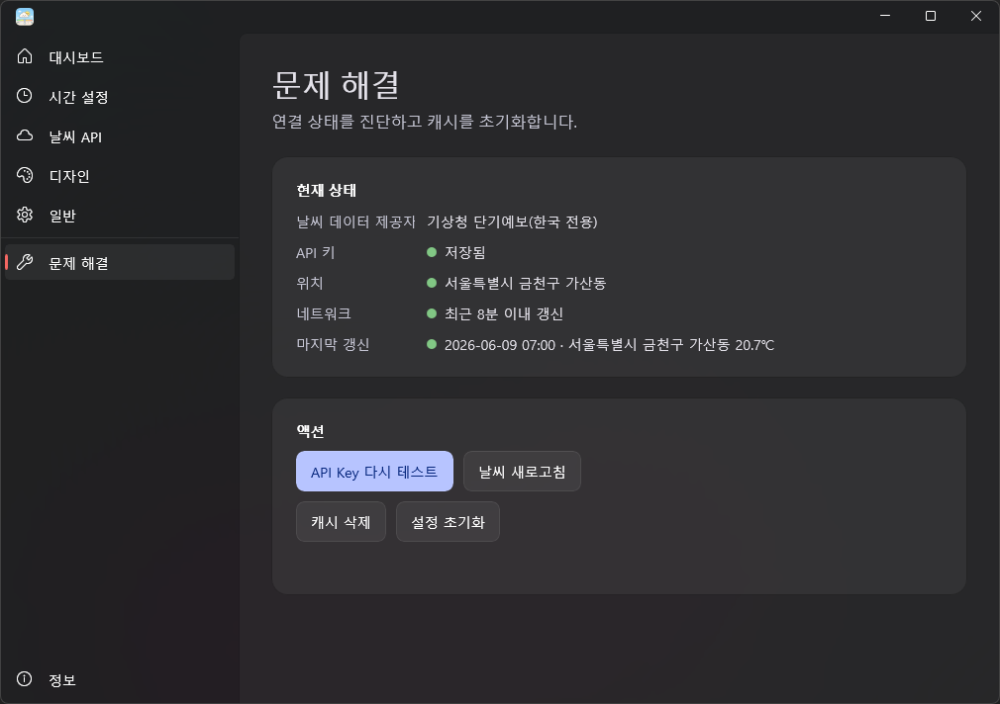

---

### ℹ️ 정보 화면

사이드바 맨 아래의 **정보** 메뉴에서 볼 수 있습니다.

- 앱 이름·**버전**과 **공식 홈페이지** 링크
- **데이터 제공** — WeatherAPI와 기상청(KMA) 출처 안내 및 발급 페이지 링크
- **아이콘 제공** — 날씨 아이콘(meteocons) 출처와 라이선스 원문 보기
- **오픈소스 라이선스** — 앱이 사용하는 오픈소스 패키지 목록 (각 항목 클릭 시 해당 페이지로 이동)

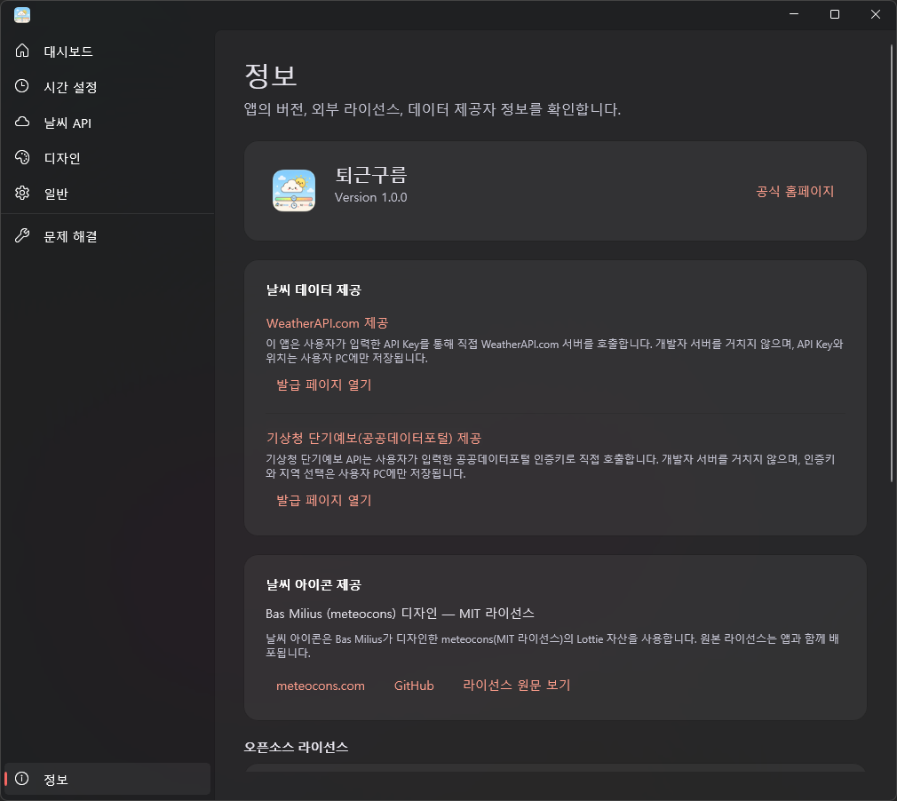

---

### 🐾 트레이 아이콘과 메뉴

퇴근구름은 작업 표시줄 오른쪽 끝(시계 옆) **트레이**에 항상 떠 있습니다.

- **아이콘 더블클릭** — 메인 창을 엽니다. (트레이에 숨어 있던 창도 다시 앞으로 나옵니다.)
- **아이콘 오른쪽 클릭** — 메뉴가 나옵니다.

> 메인 창의 닫기(X)는 앱을 끄지 않고 트레이로 보냅니다. 완전히 종료하려면 트레이 메뉴의 **종료**를 사용하세요.

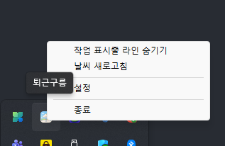

---

## 자주 묻는 질문

**Q. 창을 닫으면 앱이 꺼지나요?**
아니요. 트레이로 들어가 계속 동작하며 작업 표시줄 위 라인을 그립니다. 완전히 끄려면 트레이 메뉴의 "종료"를 누르세요.

**Q. 날씨가 안 보여요.**
[날씨 API](#-날씨-api-화면) 화면에서 제공자·위치·API Key가 모두 설정됐는지 확인하세요. [문제 해결](#-문제-해결-화면) 화면의 상태 진단으로 어디가 비어 있는지 한 번에 볼 수 있습니다.

**Q. API Key는 어디서 발급받나요?**
**WeatherAPI.com** 또는 **공공데이터포털(기상청 단기예보)**에서 무료로 발급받습니다. [정보](#-정보-화면) 화면이나 [날씨 API](#-날씨-api-화면) 화면의 발급 페이지 링크를 이용하세요.

**Q. 게임이나 전체화면 영상을 볼 때도 라인이 떠 있나요?**
아니요. 전체화면 앱이 앞에 오면 라인이 자동으로 양보하고, 전체화면이 끝나면 다시 나타납니다.

**Q. 라인이 작업을 가리거나 클릭을 방해하지 않나요?**
기본적으로 라인은 **클릭 투과** 상태라, 라인을 눌러도 아래의 작업 표시줄·아이콘이 눌립니다. [디자인](#-디자인-화면) 화면에서 투명도·위치도 조절할 수 있습니다.

**Q. 내 데이터가 어디로 전송되나요?**
설정·위치 같은 정보는 내 PC에만 저장됩니다. 날씨 조회 시에만 사용자가 선택한 날씨 서비스(WeatherAPI / 기상청)로 위치 정보가 전송되며, 그 외 외부 서버로는 보내지 않습니다. API Key는 안전 저장소에 보관되고 평문으로 기록하지 않습니다.

---

## 개인정보 및 데이터

퇴근구름은 **서버 없이 사용자 PC에서 로컬로만 동작**합니다. 설정과 위치는 내 PC 안에만 저장되며, 날씨 데이터를 가져올 때만 사용자가 직접 선택한 날씨 서비스로 위치가 전송됩니다. API Key는 Packaged 환경에서는 PasswordVault, Unpackaged 환경에서는 DPAPI로 안전하게 저장되고 평문·로그로 남기지 않습니다.

---

### © 2026 BitLeader Corp. All rights reserved.
